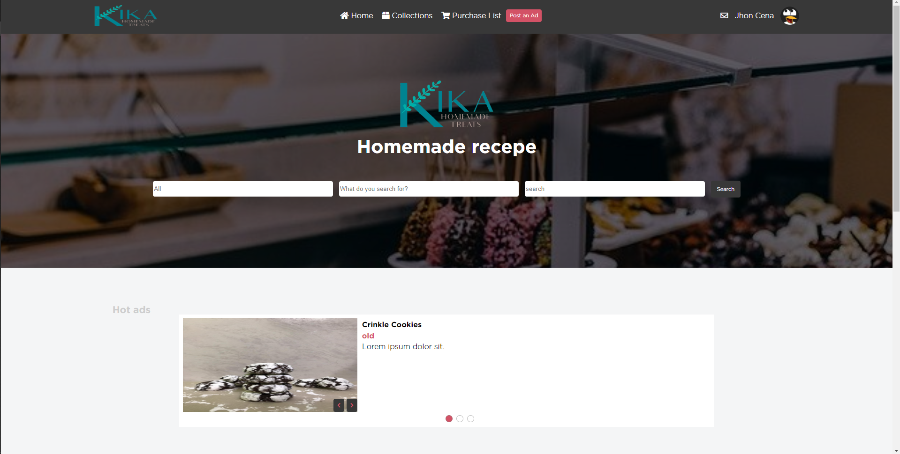

# Kika store capstone

> This is the last HTML and CSS project from Microverse program, It's a mock-up of a ZATTIX web designed by Mohammed Awad on Behance, it's built on HTML and CSS3 languages using Sass.

## :hammer: Built with:

- HTML5.
- UX.
- CSS3.
- Flexbox, Css grid.
- SCSS preprocessor
- Lighthouse and StyleLinters.
- W3 HTML Validator

## :video_camera: Video Demo

[Video Demo Link](https://www.loom.com/share/78237226bba145d882443d9fca133f07)

## :red_circle: Live Demo:

[Live Demo Link](https://kcotrinam92.github.io/store_capstone/)

## :construction_worker: Getting Started

To get a local copy up and running follow these simple steps:

- Go to the main page.
- Press the "Code" button and get the repo link.
- Clone it using git command "git clone &lt;link>".

## :bust_in_silhouette: Author

👤 **Kevin Cotrina**

- Github: [@githubhandle](https://github.com/kcotrinam92)
- Twitter: [@twitterhandle](https://twitter.com/KevinCot12)
- Linkedin: [linkedin](https://www.linkedin.com/in/kevin-cotrina-6208b7149/)

## 🤝 :raised_hand: :raised_hand: Contributions

Contributions, issues and feature requests are welcome!

Feel free to check the [issues page](https://github.com/kcotrinam92/store_capstone/issues).

## Show your support

Give a :star: if you like this project!.

## :grey_exclamation: Acknowlegment

- Website developed based on [ZATTIX](https://www.behance.net/gallery/24796463/ZATTIX)
- To [Microverse](https://www.microverse.org/)
- Stand up team

## 📝 License

This project is [MIT](./LICENSE) licensed.
